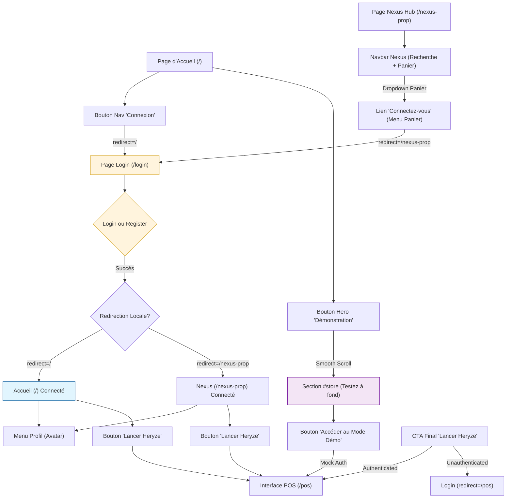

# Flux d'Authentification & Navigation

Ce document répertorie le flux logique de connexion et de redirection pour l'écosystème Nexus / Heryze.

## Schéma de Navigation

## Résumé du Comportement

1. **Persistance de l'origine** : Le paramètre `redirect` dans l'URL garantit que l'utilisateur revient à sa page de départ après connexion.
2. **Contextualisation des CTAs** :
    *   **Hero** : Orienté découverte ("Démonstration") avec scroll vers la zone de test.
    *   **Navbars** : Orientées accès rapide ("Connexion" ou "Lancer Heryze").
    *   **Conclusion** : Bouton intelligent qui détecte l'état d'authentification pour mener directement au `/pos`.
3. **Accès Démo** : Un mode sans friction qui simule une session authentifiée pour tester l'interface `QuickPos`.
4. **Gestion du Profil** : Une fois connecté, un avatar avec initiales remplace les éléments de connexion, offrant un menu pour la gestion du compte et la déconnexion.
