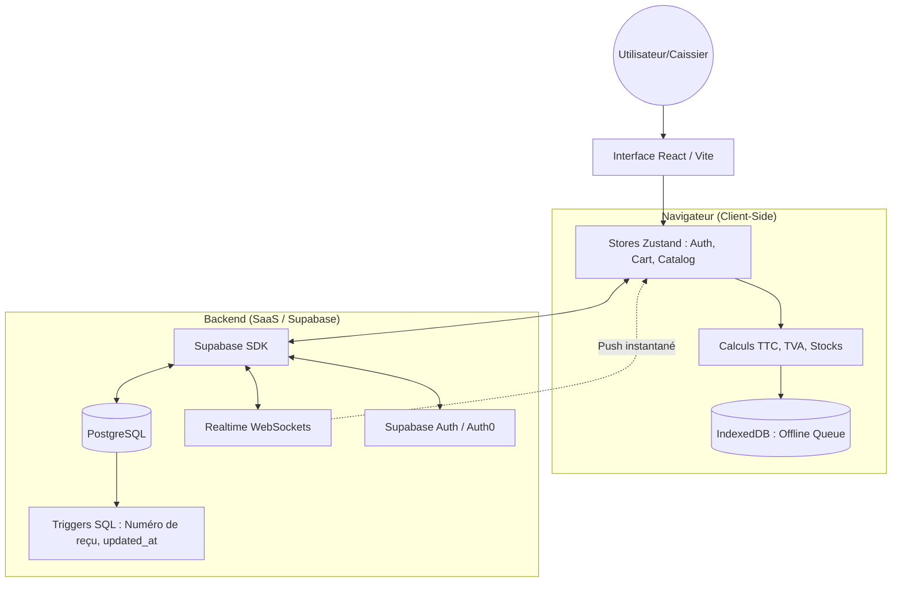

# 🏗️ Structure & Architecture : Heryze (OmniPOS)

Ce document détaille le fonctionnement technique du projet, son architecture hybride "CSR-First" et le rôle crucial de Supabase. Il est conçu pour servir de base de connaissance à une IA experte ou un nouveau développeur.

---

## 1. 🌐 Architecture Globale : "CSR-First" & Résilience

Heryze repose sur une approche **Client-Side Rendering (CSR)** poussée à l'extrême. Contrairement à un SaaS classique où le serveur calcule les totaux et les stocks, ici, **l'intelligence est dans le navigateur**.

### Pourquoi ce choix ?
*   **Vitesse (Zéro Latence)** : Pas d'attente de réponse serveur pour ajouter un produit ou calculer un total.
*   **Mode Offline** : La caisse doit fonctionner même si le Wi-Fi tombe.
*   **Économie de ressources** : Le backend (Supabase) ne fait que du stockage et de la diffusion (Realtime).

### Schéma de flux de données

---

## 2. 🧠 Le rôle du Backend (Supabase)

Bien que l'intelligence soit côté client, le backend est le "garant de la vérité" et de la sécurité.

### Ce que fait le Backend :
1.  **Persistance des données** : Stocke les produits, les ventes et les configurations.
2.  **Sécurité (RLS - Row Level Security)** : C'est la brique critique. Le backend vérifie via des politiques SQL que le `business_id` d'une vente correspond bien à l'utilisateur connecté (`auth.uid()`).
3.  **Synchronisation Multi-postes (Realtime)** : Si un administrateur change un prix sur son PC, Supabase pousse l'info via WebSocket à tous les iPads en boutique instantanément.
4.  **Automatisation SQL (Triggers)** : Génère les numéros de reçus (`REC-2026...`) de manière séquentielle et sécurisée lors de l'insertion.

### Ce qu'il NE fait PAS :
*   Il ne calcule pas le montant total de la vente (envoyé tout prêt par le client).
*   Il ne gère pas la logique de panier (purement locale à Zustand).

---

## 3. 🛡️ Gestion de l'Offline & Résilience

Le store `useCartStore.ts` gère une file d'attente intelligente :

1.  **Vente effectuée** : Le client calcule le `SalePayload`.
2.  **Check Connexion** : 
    *   *Si Online* : Envoi immédiat à Supabase.
    *   *Si Offline* : Stockage cryptique dans **IndexedDB** via `idb-keyval`.
3.  **Récupération** : Dès que l'événement `online` est détecté, le client "purge" la file d'attente vers Supabase.

---

## 💳 4. Intégrations Tierces (Stripe & Auth0)

Le projet est conçu pour être extensible :
*   **Auth0** : Peut remplacer Supabase Auth pour une gestion d'identité plus complexe (SSO, etc.).
*   **Stripe** : Géré via des **Edge Functions** (Backend-as-a-Service). Le client demande une session de paiement, Supabase fait le pont avec Stripe, et Stripe confirme au client (Webhook).

---

## 🎯 Résumé pour une IA Experte
> "Heryze est une **PWA (Progressive Web App)** réactive utilisant **Zustand** pour le state management persistant et **Supabase** comme couche de données temps réel. La logique métier est décentralisée (Client-side), les calculs de taxes et de stocks sont effectués avant l'envoi. La sécurité est assurée au niveau granulaire de la base de données via **PostgreSQL RLS**, garantissant l'étanchéité du multi-tenant sans API métier intermédiaire (PostgREST direct)."
